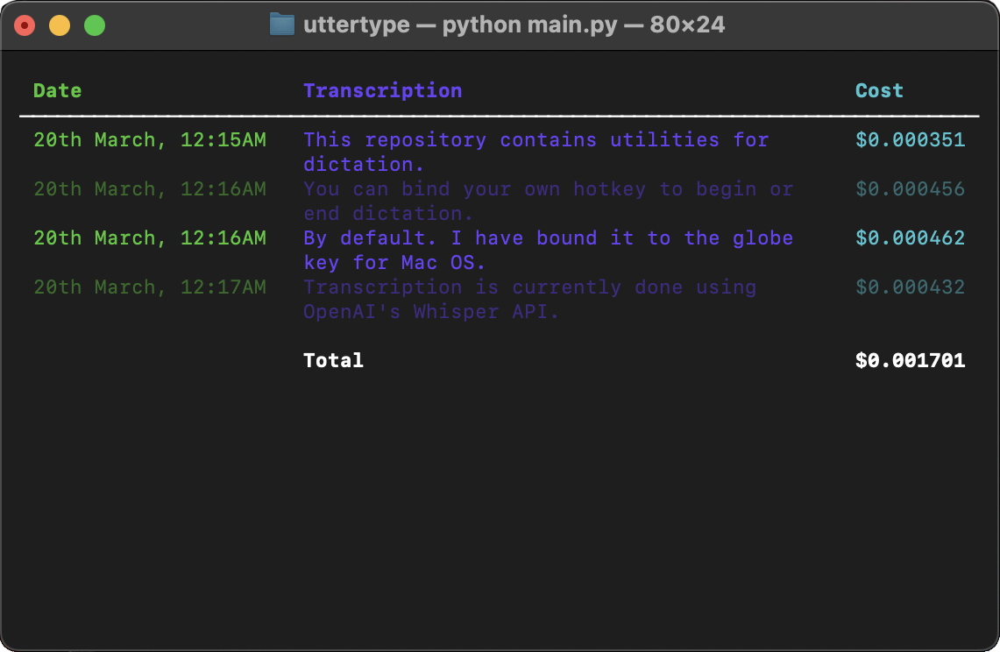

# UtterType

> Real-time speech-to-text transcription at your fingertips

[](https://www.youtube.com/watch?v=eSDYIFzU_fY)



## Features

- Press a hotkey to start voice recording
- Release to instantly get text transcription
- Supports multiple transcription providers:
  - OpenAI Whisper API
  - Google Gemini
  - Local Apple Silicon MLX (Mac only)
  - Self-hosted Whisper servers

## Setup

### 1. Install PortAudio/PyAudio

UtterType requires PortAudio to capture audio from your microphone.

<details>
<summary><b>macOS</b> - Click to expand</summary>

Installing PortAudio on macOS is easiest with Homebrew:

```bash
brew install portaudio
```

Then install PyAudio:

```bash
pip install pyaudio
```
</details>

<details>
<summary><b>Windows</b> - Click to expand</summary>

On Windows, PyAudio typically installs without additional dependencies:

```bash
python -m pip install pyaudio
```
</details>

<details>
<summary><b>Linux</b> - Click to expand</summary>

On Linux, install the system package:

```bash
sudo apt-get install python3-pyaudio
```
</details>
### 2. Configure HotKey

UtterType uses a keyboard hotkey that you hold down to record audio and release to transcribe.

- **macOS**: Uses the globe key (&#127760;) by default (bottom left of keyboard)
- **Windows/Linux**: Configure in your `.env` file:

```env
UTTERTYPE_RECORD_HOTKEYS="<ctrl>+<alt>+v"
```

UtterType uses the [pynput library](https://pynput.readthedocs.io/en/latest/keyboard.html#global-hotkeys) for hotkey functionality. See their documentation for more key combinations.

### 3. Install Dependencies

<details open>
<summary><b>Option A: Using uv (Recommended)</b></summary>

1. Install uv if you haven't already:
   - Follow the [uv installation documentation](https://docs.astral.sh/uv/getting-started/installation/)

2. Create a virtual environment and install dependencies:
   ```bash
   uv sync
   ```

   This will:
   - Create a virtual environment in `.venv`
   - Install all dependencies from pyproject.toml
   - Install uttertype in development mode

3. Activate the virtual environment:
   ```bash
   # On Linux/macOS
   source .venv/bin/activate  
   
   # On Windows
   .venv\Scripts\activate
   ```
</details>

<details>
<summary><b>Option B: Using pip</b></summary>

Install in development mode with pip:
```bash
pip install -e .
```
</details>

<details>
<summary><b>Troubleshooting: Linux GLIBCXX errors</b></summary>

If you see an error like this on Linux:
```
ImportError: /home/soul/anaconda3/lib/libstdc++.so.6: version `GLIBCXX_3.4.32' not found
```

This is typically caused by Conda environments. See solutions on:
- [StackOverflow](https://stackoverflow.com/questions/72540359/glibcxx-3-4-30-not-found-for-librosa-in-conda-virtual-environment-after-tryin)
- [Berkeley guide](https://bcourses.berkeley.edu/courses/1478831/pages/glibcxx-missing)
</details>


### 4. Configure Speech Recognition

UtterType supports multiple speech recognition providers:

| Provider | Description | API Key Required | Platforms |
|----------|-------------|-----------------|-----------|
| OpenAI Whisper | Cloud-based transcription | Yes | All |
| Google Gemini | Cloud-based transcription | Yes | All |
| Apple MLX | Local transcription on Mac | No (HF token needed) | macOS (M1/M2/M3) |
| Local Whisper Server | Self-hosted server | No | All |

#### Setup Steps

<details open>
<summary><b>Step 1: Create .env file (Recommended)</b></summary>

1. Copy the sample environment file:
   ```bash
   cp .sample_env .env
   ```

2. Edit the `.env` file to uncomment and configure your chosen provider's section.

See [`.sample_env`](.sample_env) for the complete configuration reference.
</details>

<details>
<summary><b>Step 2: Choose your provider</b></summary>

Set the `UTTERTYPE_PROVIDER` in your `.env` file to one of:

```env
# Options: "openai" (default), "mlx" (Mac only), or "google"
UTTERTYPE_PROVIDER="openai"
```
</details>

<details>
<summary><b>Alternative: Using Environment Variables</b></summary>

Instead of a `.env` file, you can set variables directly in your terminal:

**OpenAI Whisper** (Linux/macOS):
```bash
export UTTERTYPE_PROVIDER="openai"
export OPENAI_API_KEY="sk-your-key-here"
```

**Apple Silicon MLX** (Mac only):
```bash
export UTTERTYPE_PROVIDER="mlx"
export HF_TOKEN="your-huggingface-token"
# Also run: uv sync --extra mlx
```

**Google Gemini** (Linux/macOS):
```bash
export UTTERTYPE_PROVIDER="google"
export GEMINI_API_KEY="your-api-key-here"
```

For Windows, use `$env:` instead of `export`.
</details>

#### Advanced Configuration Options

<details>
<summary><b>Google Vertex AI</b></summary>

For enterprise Google Vertex AI integration:

1. Install the [Google Cloud CLI](https://cloud.google.com/sdk/docs/install)
2. Authenticate: `gcloud auth application-default login`
3. Configure in `.env`:
   ```env
   UTTERTYPE_PROVIDER="google"
   GEMINI_USE_VERTEX="true"
   GEMINI_PROJECT_ID="your-gcp-project-id"
   GEMINI_LOCATION="us-central1"  # optional
   ```

See [Vertex AI docs](https://cloud.google.com/vertex-ai/docs/authentication) for more details.
</details>

<details>
<summary><b>Local Whisper Server</b></summary>

For faster and cheaper transcription, set up a local [faster-whisper-server](https://github.com/fedirz/faster-whisper-server):

1. Configure in `.env`:
   ```env
   UTTERTYPE_PROVIDER="openai"
   OPENAI_BASE_URL="http://localhost:7000/v1"
   ```

2. Available local models include:
   - `Systran/faster-whisper-small` (fastest)
   - `Systran/faster-distil-whisper-large-v3` (most accurate)
   - `deepdml/faster-whisper-large-v3-turbo-ct2` (almost as good, but faster)
</details>

<details>
<summary><b>Apple Silicon MLX Models</b></summary>

For the fastest local transcription on Apple Silicon Macs (M1/M2/M3):

1. Install the MLX dependencies:
   ```bash
   uv sync --extra mlx
   ```
   
2. Configure in `.env`:
   ```env
   UTTERTYPE_PROVIDER="mlx"
   MLX_MODEL_NAME="distil-medium.en"
   HF_TOKEN="your-huggingface-token"  # Get from huggingface.co/join
   ```

This uses [lightning-whisper-mlx](https://github.com/mustafaaljadery/lightning-whisper-mlx) to run Whisper models natively on the Apple Neural Engine.

Available models with speed/accuracy tradeoffs:
| Model | Size | Language | Speed | Accuracy |
|-------|------|----------|-------|----------|
| `base.en` | Small | English only | ★★★★★ | ★★ |
| `small.en` | Medium | English only | ★★★★ | ★★★ |
| `medium.en` | Large | English only | ★★★ | ★★★★ |
| `distil-small.en` | Medium | English only | ★★★★ | ★★★ |
| `distil-medium.en` | Large | English only | ★★★ | ★★★★ |
| `large-v2` | Extra large | Multilingual | ★★ | ★★★★★ |
</details>

### 5. Launch UtterType

<details open>
<summary><b>Start the application</b></summary>

Choose one of these methods to run UtterType:

```bash
# Standard (recommended)
python -m uttertype.main

# Simple wrapper
python main.py

# If installed in environment
uttertype

# Background with tmux (auto-setup)
./start_uttertype.sh
```
</details>

<details>
<summary><b>Required Permissions</b></summary>

When first launching, you'll need to grant these permissions:

**macOS:**
1. System Settings → Privacy & Security → Accessibility
2. System Settings → Privacy & Security → Input Monitoring
3. Microphone access

**Windows/Linux:**
- Microphone access permissions
</details>

## Usage

1. Press and hold your configured hotkey (globe key on macOS, `<ctrl>+<alt>+v` on other platforms by default)
2. Speak clearly while holding the key
3. Release the key when finished
4. Your transcribed text will be inserted at the cursor position

## Troubleshooting

<details>
<summary><b>Common Issues</b></summary>

- **Hotkey not working**: Check permissions in System Settings (macOS) or verify hotkey configuration
- **No microphone input**: Check microphone permissions and default device settings
- **API key errors**: Verify your API keys are correctly set in the `.env` file
- **Missing models**: For MLX, ensure you've run `uv sync --extra mlx` and provided a HuggingFace token
</details>

## License

UtterType is available under the MIT License. See the [LICENSE](LICENSE) file for details.
